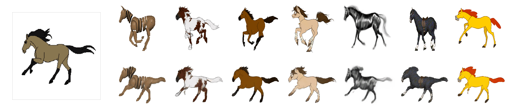

# First Order Motion Model for Image Animation

This repository contains the source code for the paper [First Order Motion Model for Image Animation](https://papers.nips.cc/paper/8935-first-order-motion-model-for-image-animation) by Aliaksandr Siarohin, [Stéphane Lathuilière](http://stelat.eu), [Sergey Tulyakov](http://stulyakov.com), [Elisa Ricci](http://elisaricci.eu/) and [Nicu Sebe](http://disi.unitn.it/~sebe/). 

## Example animations

The videos on the left show the driving videos. The first row on the right for each dataset shows the source videos. The bottom row contains the animated sequences with motion transferred from the driving video and object taken from the source image. We trained a separate network for each task.

### VoxCeleb Dataset

### Fashion Dataset

### MGIF Dataset

